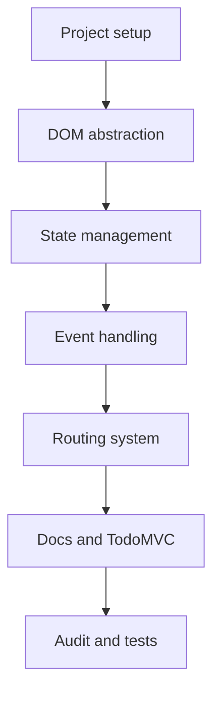

# Roadmap — mini-framework

A custom JS framework (DOM abstraction, routing, state management, event handling) plus a TodoMVC app built with it.

## Build sequence

1. **Project setup** — repo structure, ES modules, no external framework/library allowed.
2. **DOM abstraction** — represent HTML as a JS object (`tag`, `attrs`, `children`) and turn it into real DOM elements.
3. **State management** — a central store reachable from anywhere, with a way to notify subscribers of changes.
4. **Event handling** — your own event API that wraps `addEventListener` internally.
5. **Routing system** — sync the URL with the app's state.
6. **Documentation & TodoMVC** — write the markdown docs, then build the TodoMVC app using your framework.
7. **Audit & tests** — check every point in `audit.md` (features, structure, TodoMVC behavior).

Each step depends on the previous one: routing needs state, state needs events to be triggered, etc.

## TODO — what to learn, in order

- [ ] **JS and native DOM** — closures, ES6 modules (import/export), `document.createElement`, `appendChild`, `setAttribute`, `addEventListener`.
- [ ] **Virtual DOM concept** — representing HTML as a JS object and turning it into real DOM; look at simple implementations before building your own.
- [ ] **DOM abstraction** — implement `createElement(tag, attrs, children)` and a recursive `render()` function for nested children.
- [ ] **State management** — observer/pub-sub pattern; a store with `getState`, `setState`, `subscribe`.
- [ ] **Custom event handling** — an event API (e.g. an `onClick` attribute in your virtual DOM object) that calls `addEventListener` internally.
- [ ] **Routing synced with state** — History API (`pushState`, `popstate`) or `hashchange`; a URL change triggers a state change and vice versa.
- [ ] **Markdown documentation** — feature overview, code examples (create an element, add an attribute, nest elements, create an event), explanation of how it works internally.
- [ ] **TodoMVC and final audit** — standard structure (classes, ids, Active/Completed filters, counter, Clear completed); check every point in `audit.md`.

## Practical tips

- Start small: get `createElement` + `render` working on a minimal example before adding attributes and nested children.
- Test each piece in isolation before wiring them together — a bug in state management is much harder to find once routing and events depend on it too.
